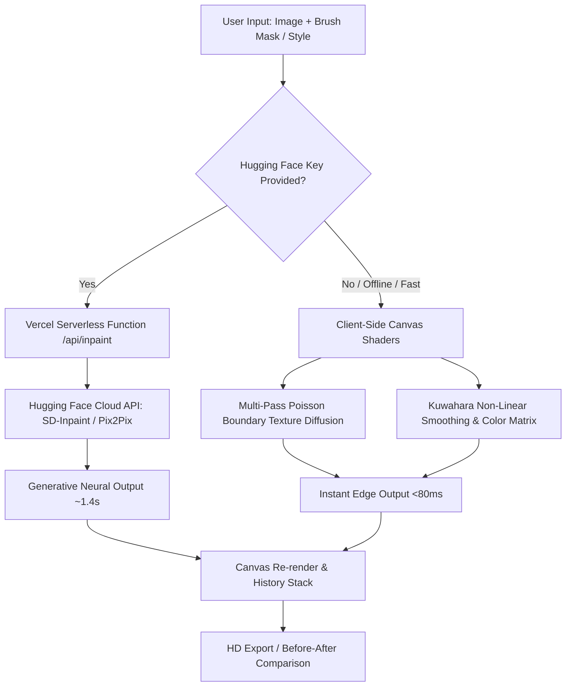

# Lumen AI — Wireframes & UX Design Thinking (Inter IIT 14.0 — PS-07)

This document details the mobile-first ergonomics, layout hierarchy, and interaction mechanics designed for Lumen AI.

---

## 1. Mobile (375px Viewport) — Ergonomic Bottom-Weighted Workspace

On mobile devices (<768px), UI ergonomics require all primary thumb interactions to reside in the bottom 40% of the screen, while the canvas maintains uninhibited focus in the upper viewport.

```
+------------------------------------------+
|  [✦] LUMEN v1.0    [<250KB]  [IIT 14.0]  |  <-- Sticky 16px Navbar
+------------------------------------------+
|                                          |
|   +----------------------------------+   |
|   | [Brush: 32px ---O-] [Undo][Clear]|   |  <-- Glass Control Pill
|   +----------------------------------+   |
|                                          |
|   +----------------------------------+   |
|   |                                  |   |
|   |         CANVAS VIEWPORT          |   |  <-- High-DPI Canvas
|   |         [Image + Overlay]        |   |      (min-h: 280px,
|   |                                  |   |       touchAction: none)
|   |  (•) Dynamic Cursor Follower     |   |
|   |                                  |   |
|   | [ 1 Masked Region ]              |   |  <-- Monospace Telemetry
|   +----------------------------------+   |
|                                          |
|   +----------------------------------+   |
|   | [<] Exit  [Object] [Style] [Exp] |   |  <-- Primary Thumb Toolbar
|   +----------------------------------+   |
|                                          |
|   +----------------------------------+   |
|   | [✦ Erase Selected Object ]       |   |  <-- Primary CTA (44px min tap)
|   | Progress: [=========>   ] 60%    |   |  <-- Progressive Status
|   +----------------------------------+   |
|                                          |
|  (✓) Inpaint completed in 42ms (Edge)    |  <-- Latency Feedback
+------------------------------------------+
```

---

## 2. Before/After Split Comparison Wireframe (Style Transfer Mode)

```
+------------------------------------------+
|  [ Comparison Mode:  (Canvas) [Split] ]  |
+------------------------------------------+
|                                          |
|   +----------------------------------+   |
|   | BEFORE (ORIG)  |   AFTER (STYLED)|   |
|   |                |                 |   |
|   |   Original     |   Cyberpunk     |   |
|   |   Mountain     |   Neon-Toned    |   |
|   |   Landscape    |   Palette       |   |
|   |                |                 |   |
|   |          [<-- (||) -->]          |   |  <-- Draggable Split Divider
|   |                |                 |   |
|   +----------------------------------+   |
|                                          |
|   [ Drag slider or ]  [👁 Hold for Orig] |  <-- Instant A/B Toggle
+------------------------------------------+
|   STYLE PRESETS (6 Archetypes):          |
|   [■ Cyberpunk] [■ Monochrome] [■ Oil]   |  <-- 2x3 Grid on Mobile
|   [■ Anime]     [■ Vintage]    [■ Blue]  |
+------------------------------------------+
```

---

## 3. Dual-Tier Inference Flow Diagram (System Architecture)



---

## 4. Key Design Decisions (Overriding Generic AI UI Defaults)

1. **Zero Emojis**: Replaced with SVG primitives and Phosphor/Lucide icons with uniform 1.5/2.0 stroke weights.
2. **Anti-Lila Color Palette**: Strict Neutral Zinc (`#09090b`) base with a single Emerald-500 (`#10b981`) accent and Rose-500 (`#f43f5e`) destructive brush highlight.
3. **Deterministic Typography**: `Outfit` Sans for headlines and body paired with `JetBrains Mono` for latency benchmarks, file sizes, and memory usage.
4. **Viewport Stability**: Replaced `h-screen` everywhere with `min-h-[100dvh]` to prevent viewport layout jumps on iOS Safari and mobile Chrome address bar expansions.
5. **No Card Overuse**: Section borders and subtle glass highlights (`rgba(255,255,255,0.08)`) replace heavy generic drop-shadow boxes.
